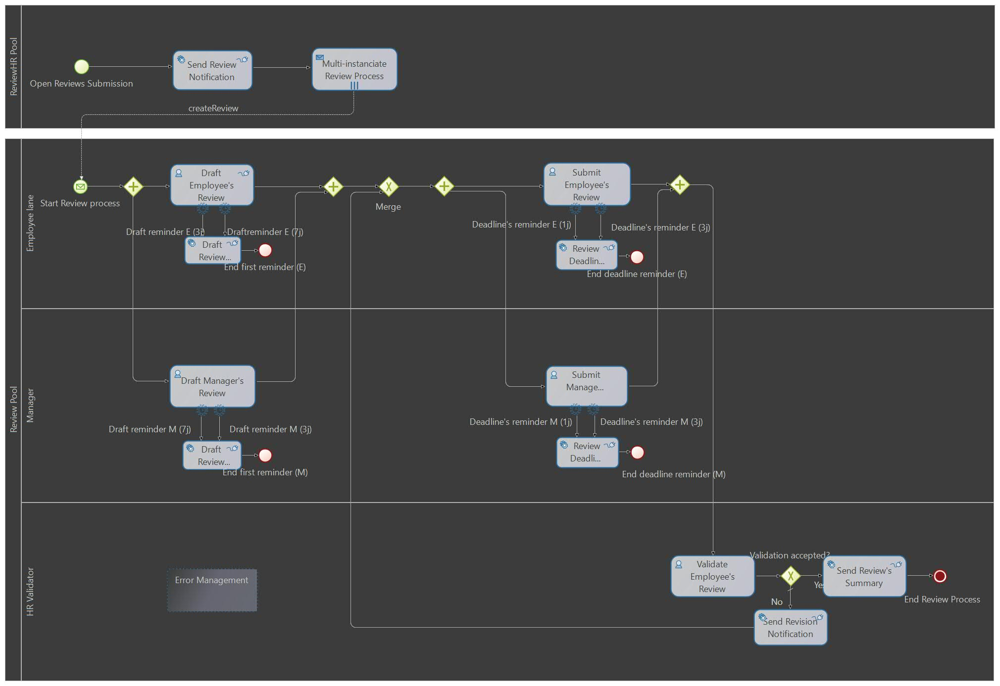

# 🚀 ReviewBuddy (Bonita Community Edition: 2021.1)

  

## What's ReviewBuddy?

ReviewBuddy is an App that automates Review Processes. From the time an HR representative notifies employees to draft reviews, to the final validation of these Reviews by HR and providing a PDF summary of each.

## What are the sub-processes of ReviewBuddy?

* ReviewHR Pool:

   1) This sub-process allows HR representatives to notify employees that a Review Submission period has started and that they can start drafting their Reviews as well as schedule a Review meeting with their managers.

* Review Pool:

   1) This sub-process starts after the HR representative sends a review notification. 

   2) Employees and managers find a Review Draft task assigned to them in the portal. 

   3) Once both submit a Review Draft and schedule a meeting, they can access and view the information submitted and discuss it. 

   4) Finally, HR representatives can check the information shared and validate (or ask for a review revision) the Review, generating a review summary in PDF format that'll be shared with the involved parties.

## How can I get ReviewBuddy and adjust it to my company's needs?

Definitly! All you'll need is to download the latest version of Bonita Community Edition and clone this project.

## Are contributions welcome?

Of course, please don't hesitate pushing any PRs that you feel they could help the community.

1. Fork the repository
2. Create your feature branch (`git checkout -b feature/NetworkingInnovation`)
3. Commit your changes (`git commit -m 'Add intelligent matching algorithm'`)
4. Push to the branch (`git push origin dev/NetworkingInnovation`)
5. Open a Pull Request
6. 
Also for more in-depth information, please feel free to check this article on my blog:

https://www.blog.ismaillagouilly.com/reviewbuddy-bpm-review-process-automation/

Enjoy! :wink:
